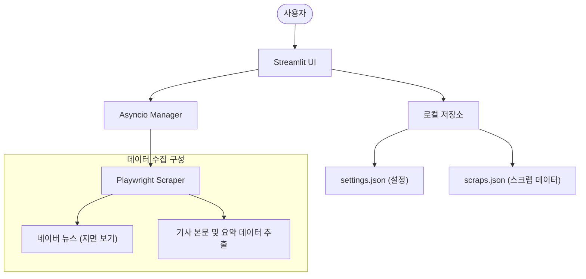

# 뉴스룸 (News Room)

네이버 뉴스의 신문 지면 서비스를 활용하여 기사를 면 단위로 모아볼 수 있는 애플리케이션입니다. 종이 신문의 레이아웃을 디지털 환경에서 효율적으로 탐색하고 관리할 수 있도록 제작되었습니다.

## 주요 기능

- 여러 언론사의 신문 지면을 1면부터 순서대로 확인
- 비동기 처리를 통한 다수 언론사 데이터 병렬 로딩 및 속도 최적화
- 기사 상세 페이지 분석을 통한 제목 및 부제목(요약문) 자동 추출
- 관심 있는 기사를 저장하고 관리할 수 있는 스크랩북
- 사용자 설정에 따른 언론사(OID) 추가 및 삭제 관리

## 시스템 구조

이 프로젝트는 파이썬 기반의 데이터 수집 모듈과 웹 인터페이스로 구성됩니다.



- 인터페이스: Streamlit을 사용한 웹 기반 그리드 레이아웃
- 데이터 수집: Playwright를 활용하여 자바스크립트 기반 동적 페이지 데이터 수집
- 성능 제어: asyncio와 Semaphore를 활용한 동시 요청 수 조절 및 시스템 안정화
- 데이터 관리: 별도의 DB 설치 없이 로컬의 JSON 파일을 이용해 데이터 영속성 유지

## 설치 및 실행 방법

파이썬 3.8 이상의 환경이 필요합니다.

1. 저장소를 클론하거나 코드를 다운로드합니다.
2. 필요한 라이브러리를 설치합니다.
   ```bash
   pip install -r requirements.txt
   ```
3. 웹 브라우징을 위한 Playwright 환경을 설정합니다.
   ```bash
   playwright install chromium
   ```
4. 앱을 실행합니다.
   ```bash
   streamlit run app.py
   ```

## 프로젝트 구성 파일

- app.py: 사용자 화면 UI 구성 및 전체적인 서비스 흐름 제어
- scraper.py: Playwright 기반의 네이버 뉴스 지면 크롤링 및 텍스트 데이터 가공
- storage.py: 로컬 JSON 파일에 대한 데이터 입출력 기능 담당
- settings.json: 기본 언론사 목록 및 사용자 환경 설정 저장

## 주의사항

- 이 서비스는 네이버 뉴스의 웹 구조를 바탕으로 작동하므로, 네이버 측의 페이지 구조 변경 시 작동에 영향을 받을 수 있습니다.
- 무분별한 대량 요청은 서비스 이용 제한의 원인이 될 수 있습니다. 내부적으로 설정된 동시 실행 제한 기능을 유지해 주세요.
